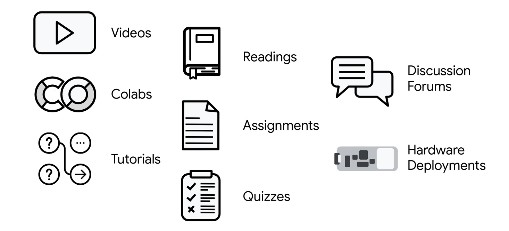
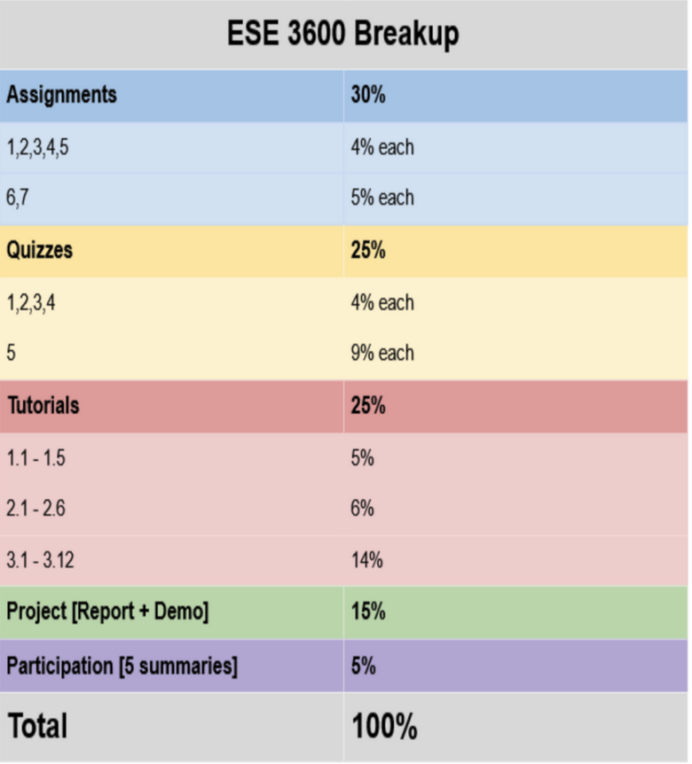

.. API
.. ===
   .. :toctree: generated

   .. lumache
.. My Single Page Website

***********************
TinyML @ UPenn
***********************

Introduction
============

This is a website which contains all the information about the TinyML course being taught by Professor Rahul Mangharam at UPenn. 

.. image:: imgs/tinyml.jpg
   :alt: My image
   :width: 600

Course Overview
------------

The course is split into 3 modules and can be easily understood if followed in order. The modules are:  

* Module 1 - Introduction to TinyML  
* Module 2 - Applications in TinyML  
* Module 3 - Deploying TinyML  

Workflow & Grading
------------
The workflow for the course is as follows.

The grading structure is as follows.

Sample Projects : Fall 22
===========

Here are some sample projects from the Fall 2022 semester.

* `TinyML robot <https://www.youtube.com/embed/watch?v=-Rn3QVjB8PA>`_
* `Pedestrian light detection <https://www.youtube.com/embed/watch?v=e5NfGWAu06Q>`_
* `DnD dice reader <https://www.youtube.com/embed/watch?v=c7OoO8QS2fg&t=1s>`_

Here are some sample projects from the Spring 2023 semester.

* Add projects here

Schedule
==========

.. raw:: html

   <iframe src="https://docs.google.com/spreadsheets/d/15NhWs41SMqgMNtThJUJDJ5nqhBOybxX-Ll4fhEmHe-g/edit?usp=sharing" width="600" height="400"></iframe>

Staff
==========
Here are the staff members for the course.

Fall 2022
---------
* Manasa Sathyan
* Tejas Agarwal

Spring 2023
---------
* Manasa Sathyan
* Tejas Agarwal

Resources
==========

Here are some resources for the course.

* `TinyML course syllabus <https://docs.google.com/document/d/1JFby6rC18-HvJ68IxXYFiRJP9viuZWtvutVjcwHCPRc/edit>`_ 
* `Magic wand capture <https://tinyml.seas.upenn.edu/magic_wand_capture.html>`_ 
* `Open speech recording plugin <https://tinyml.seas.upenn.edu/open_speech_recording.html>`_ 

**Site developed & maintained - Tejas Agarwal**

